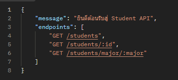
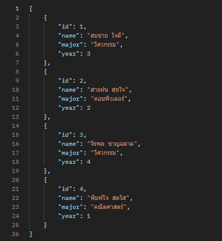
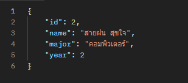
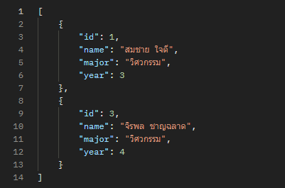
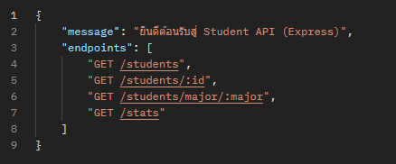
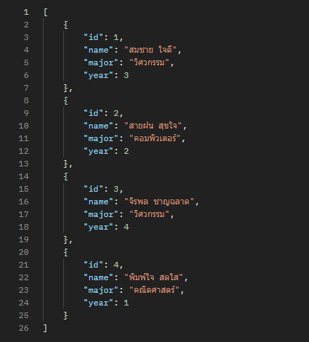
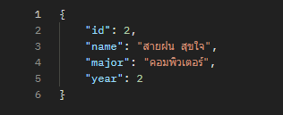
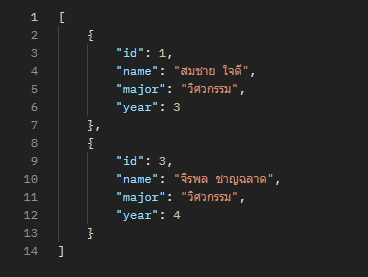
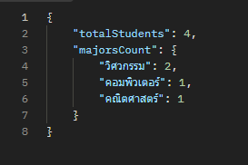

สองไฟล์ที่มีอยู่ในขั้นตอนนี้ คือไฟล์ API ที่จะใช้เปิดเป็น server ที่จะใช้ร่วมกับอีกไฟล์ที่จะทำใน lab-4-2
ในการทดสอบการรัน node http-server.js สามารถรันได้และทำการทดสอบการทำงานของ API ดังนี้
1. Health check โดยการ GET http://localhost:3000 จะได้ข้อความหน้าต่างนี้

2. GET all students โดยการ GET http://localhost:3000/students จะได้

3. GET students by id โดยการ GET http://localhost:3000/students/2 จะได้

4. GET students by major โดยการ GET http://localhost:3000/students/major/วิศวกรรม จะได้

หากทำการทดสอบแล้วขึ้น error จำเป็๋นต้องดูเลขอ้างอิงว่าผิดที่อะไร เช่นหากขึ้น 400 หรือขึ้นต้นด้วย  400 ก็เกิดจากการกรอกข้อมูลผิดเอง เป็นต้น
จากนั้นจะทำการรันทดสอบในอีก server โดยรัน node express-server.js แล้วทดสอบ
1. Health check โดยการ GET http://localhost:3001 จะได้

2. GET all students โดยการ GET http://localhost:3001/students จะได้

3. GET students by id โดยการ GET http://localhost:3001/students/2 จะได้

4. GET students by major โดยการ GET http://localhost:3000/students/major/วิศวกรรม จะได้

5. GET stats โดยการ GET http://localhost:3001/stats จะได้
