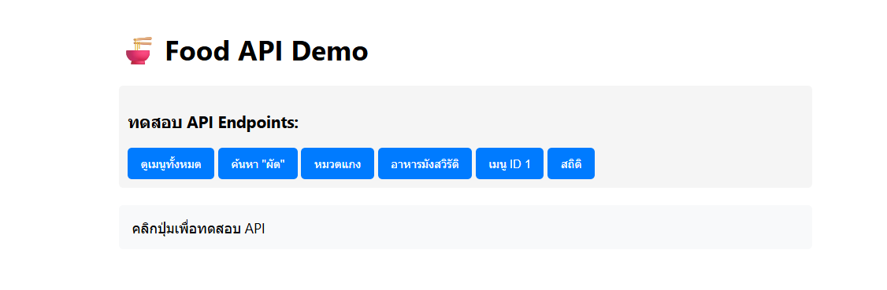
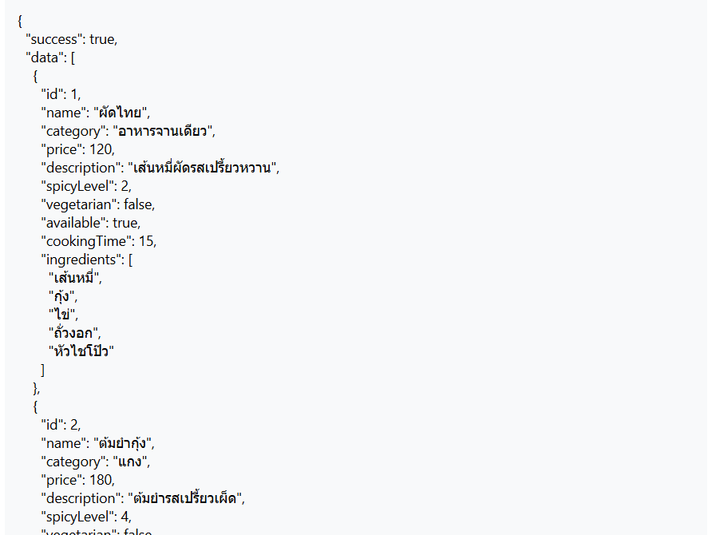
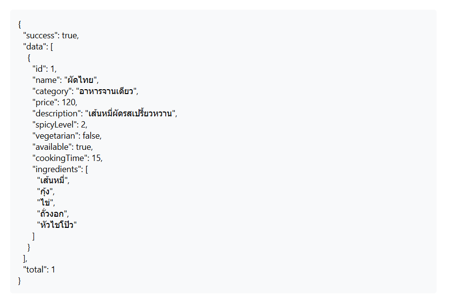
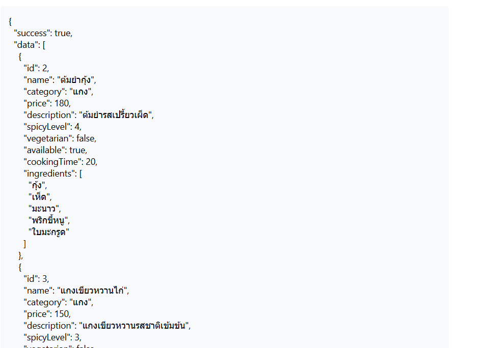
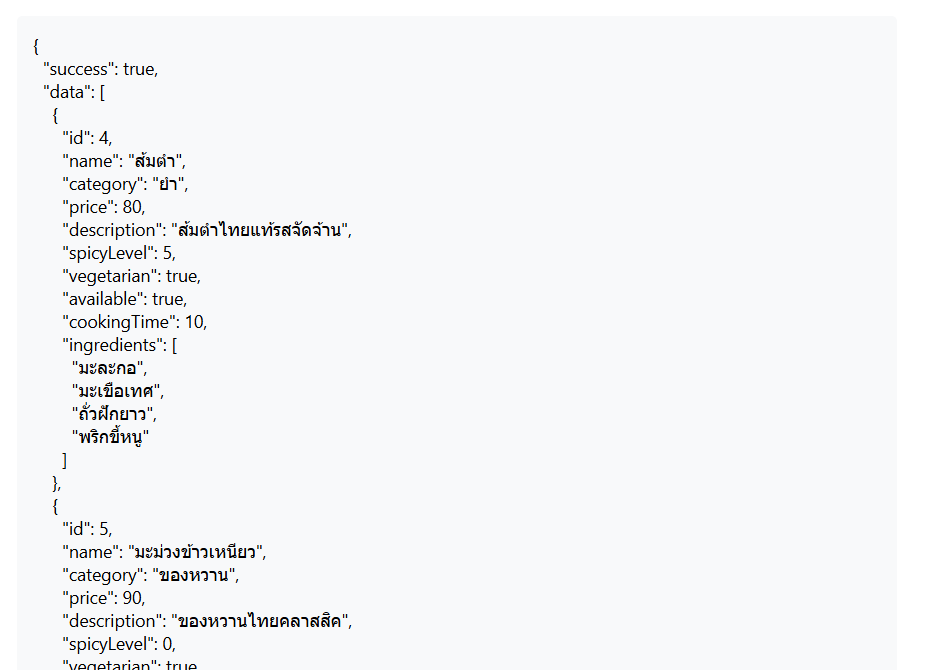
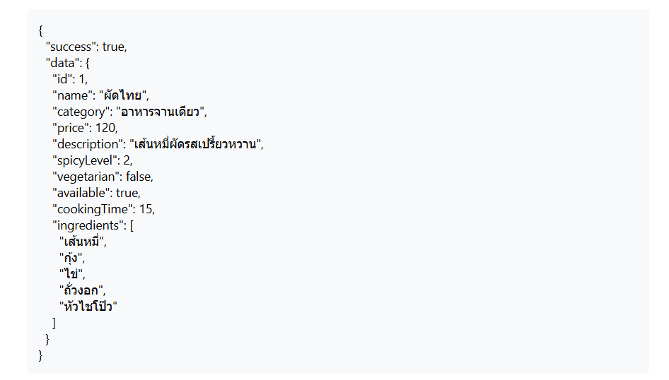
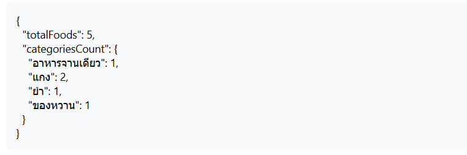

การใช้งานเริ่มจากการรันเซิร์ฟเวอร์ก่อน โดยการ node server.js จะได้เว็บนี้

จากนั้นทดลองการกดแต่ละปุ่ม เริ่มจากปุ่มดูเมนูทั้งหมด เมื่อกดแล้วควรจะขึ้นแบบนี้

การค้นหาเมนูผัด

หมวดแกง

อาหารมังสวีรัติ

เมนูที่มีไอดี == 1

และสถิติที่บอกภาพรวมของอาหาร

